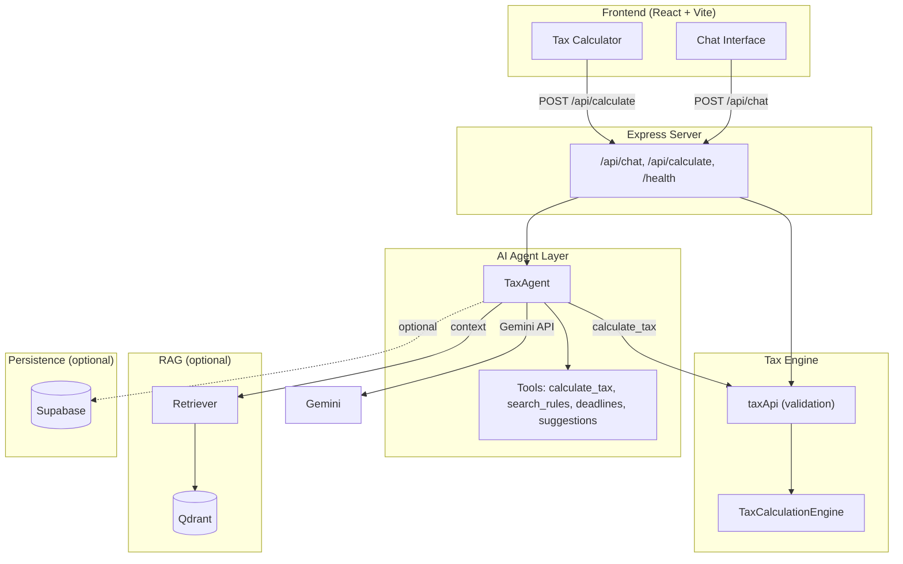

# TaxMate AI

**AI-powered Indian Income Tax Assistant for Assessment Year 2025-26 (FY 2024-25)**

TaxMate AI is a conversational tax assistant that understands natural language, retrieves relevant tax rules via RAG, and helps users plan and compute Indian income tax under both New and Old regimes. It is built for **Railway** hosting with **Qdrant** as the vector store.

---

## Table of Contents

- [Overview](#overview)
- [Architecture](#architecture)
- [Tech Stack](#tech-stack)
- [Features](#features)
- [Project Structure](#project-structure)
- [Getting Started](#getting-started)
- [Environment Variables](#environment-variables)
- [API Reference](#api-reference)
- [Tax Rules Reference](#tax-rules-reference)
- [Deployment](#deployment)
- [Development](#development)
- [Documentation](#documentation)
- [License](#license)

---

## Overview

TaxMate AI combines:

1. **Deterministic tax engine** – Slab-wise computation, special rates (VDA, STCG, LTCG), presumptive taxation, and 4% cess aligned with Budget 2024.
2. **AI agent** – Google Gemini with function calling: answers questions in natural language, calls tools (calculate tax, search rules, deadlines, suggestions), and keeps conversation context.
3. **RAG** – Qdrant vector store over a curated tax knowledge base (sections, deductions, FAQs) so answers are grounded in rules.
4. **Optional persistence** – Supabase for user profiles, tax profiles, and conversation history.

Users can either **chat** (“My salary is 15 lakhs, I have 1.5L in PPF – what’s my tax?”) or use the **calculator** form for direct computation. The app serves a single React frontend and Express API, and is deployment-ready for Railway with health checks and optional Qdrant readiness.

---

## Architecture

### High-Level Diagram



**ASCII view (same flow):**

```
Frontend (Chat | Calculator) → Express (API, static)
       ↓                              ↓
   POST /api/chat → TaxAgent → [RAG → Qdrant] + [Gemini] + [Tools]
       ↓                              ↓
   Tools → calculate_tax → taxApi → TaxCalculationEngine
   Optional: Supabase (profiles, conversations)
```

### Component Overview

| Layer | Role |
|-------|------|
| **Frontend** | React SPA: chat UI (messages, examples, input) and calculator UI (income/deduction form, result). Single deployment serves both; API base is same-origin in production. |
| **Express server** | Serves API, static frontend, health. Uses trust proxy, CORS (if `CORS_ORIGIN` set), security headers, rate limiting. |
| **TaxAgent** | Orchestrator: loads conversation history, optionally gets RAG context from Qdrant, calls Gemini with system prompt + tools, runs tool calls (e.g. `calculate_tax`), returns final message and optional calculations/suggestions. |
| **LLM (Gemini)** | Chat and function calling; also used for embeddings when Qdrant is enabled. |
| **RAG** | Qdrant store + retriever: embed query, search `tax_knowledge` collection, return top-k chunks as context for the agent. Knowledge base: markdown in `src/knowledge/` (sections, FAQs), ingested via `npm run ingest`. |
| **Tools** | `calculate_tax` (wraps engine), `search_tax_rules` (RAG or static fallback), `get_deadlines`, `suggest_tax_savings`. |
| **Tax engine** | Pure calculation: slabs, rebate 87A, special tax (VDA/STCG/LTCG), presumptive, cess. No LLM. |
| **Persistence** | Supabase: auth, user profiles, tax profiles, conversations, messages. Optional; app runs without it. |

### Data Flow (Chat)

1. User sends a message (e.g. “My salary is 15 lakhs, what’s my tax?”).
2. Server receives `POST /api/chat` with `{ message, conversationId? }`.
3. Chat route gets or creates TaxAgent (lazy init: Gemini + optional Qdrant retriever + memory + tools).
4. Agent loads conversation history for `conversationId`.
5. Retriever (if Qdrant configured) embeds the message and searches Qdrant; returned chunks are formatted as context.
6. Agent calls Gemini with system prompt, context, history, and tool definitions.
7. If Gemini returns function calls (e.g. `calculate_tax` with parsed salary), agent executes tools and may call Gemini again with tool results.
8. Final reply (and optional `calculations` / `suggestions`) is returned; message is stored in conversation memory.
9. Response is sent to client as `{ message, conversationId, calculations?, suggestions? }`.

---

## Tech Stack

| Category | Technology |
|----------|------------|
| **Runtime** | Node.js 18+ |
| **Language** | TypeScript (strict) |
| **Backend** | Express (API + static SPA) |
| **LLM** | Google Gemini (Generative AI SDK); function calling + embeddings |
| **Vector DB** | Qdrant (RAG); optional, with retry and URL normalization for Railway |
| **Auth & DB** | Supabase (optional): auth, Postgres (user_profiles, tax_profiles, conversations, messages) |
| **Frontend** | React 18, Vite, TypeScript |
| **Testing** | Vitest (engine + API layer) |
| **Deployment** | Docker / Railway (Nixpacks or Dockerfile); Qdrant via Railway plugin or Qdrant Cloud |

---

## Features

### AI & Conversation

- Natural language queries (e.g. “house rent”, “medical insurance” mapped to HRA, 80D).
- RAG over tax knowledge (sections 80C, 80D, HRA, 24(b), 115BBH, etc.) when Qdrant is configured.
- Conversation memory per `conversationId` (in-memory by default; Supabase for persisted conversations when integrated).
- Proactive suggestions (tax-saving tips, deadlines) via agent tools.
- Tool use: tax calculation, rule search, deadlines, suggestions.

### Tax Engine (AY 2025-26)

- **New regime:** Standard deduction ₹75,000; slabs 0–3L (Nil), 3–7L (5%), 7–10L (10%), 10–12L (15%), 12–15L (20%), 15L+ (30%); Rebate 87A if total income ≤ ₹7,00,000.
- **Old regime:** Standard deduction ₹50,000; slabs 0–2.5L (Nil), 2.5–5L (5%), 5–10L (20%), 10L+ (30%); Rebate 87A if total income ≤ ₹5,00,000; Chapter VI-A deductions (80C, 80D, etc.).
- **Special rates:** VDA/Crypto 30% (115BBH); STCG listed equity 20% (111A); LTCG listed equity 12.5% above ₹1,25,000 (112A).
- **Presumptive:** Section 44AD (8%/6%), 44ADA (50%).
- **Cess:** 4% Health & Education Cess.
- **Assessee:** Individual and HUF (same slab treatment).
- Validation, deduction caps, and gross income limit as per implementation (see [docs/ASSUMPTIONS.md](docs/ASSUMPTIONS.md)).

### Deployment & Ops

- Railway-ready: `railway.toml`, Nixpacks, Procfile; `PORT` from env.
- Health: `GET /health` (liveness); `GET /health?readiness=1` (optional Qdrant check).
- Qdrant: connection retry, timeout, URL normalization for Railway private networking.
- CORS, security headers, configurable rate limiting.

---

## Project Structure

```
taxmate-AI/
├── src/
│   ├── agent/                 # AI agent
│   │   ├── TaxAgent.ts        # Orchestrator: history, RAG, Gemini, tools
│   │   ├── prompts/
│   │   │   └── system.ts      # System prompt + tool descriptions
│   │   ├── tools/
│   │   │   ├── index.ts       # getAllTools, exports
│   │   │   ├── calculateTax.ts
│   │   │   ├── searchRules.ts # RAG or static fallback
│   │   │   ├── getDeadlines.ts
│   │   │   └── suggestSavings.ts
│   │   └── memory/
│   │       └── ConversationMemory.ts
│   ├── llm/
│   │   └── gemini.ts          # Gemini client: chat, function calling, embed
│   ├── rag/
│   │   ├── qdrant.ts          # Qdrant client, init retry, normalize URL, health
│   │   ├── retriever.ts       # Search + getContext for agent
│   │   └── ingest.ts          # CLI: load knowledge/*.md, chunk, embed, upsert
│   ├── knowledge/             # Tax knowledge (source for RAG)
│   │   ├── sections/          # 80C, 80D, HRA, 80CCD, 24b, 115BBH, etc.
│   │   ├── faqs/
│   │   └── synonyms.ts        # Natural language → tax terms
│   ├── db/                    # Supabase (optional)
│   │   ├── supabase.ts
│   │   ├── schema.sql
│   │   └── repositories/      # users, conversations, taxProfiles
│   ├── engine/
│   │   ├── TaxCalculationEngine.ts
│   │   └── TaxCalculationEngine.test.ts
│   ├── api/
│   │   ├── taxApi.ts          # Validation + calculateTaxApi
│   │   └── taxApi.test.ts
│   ├── constants/
│   │   └── ay2025-26.ts       # Slabs, limits, rates
│   ├── types/
│   │   ├── index.ts           # Tax types
│   │   └── agent.ts           # Agent, message, tool types
│   ├── errors.ts
│   ├── server/
│   │   ├── index.ts           # Express app, routes, health, static
│   │   └── routes/
│   │       ├── chat.ts        # POST/GET/DELETE /api/chat
│   │       └── auth.ts        # /api/auth (Supabase)
│   ├── index.ts               # Public exports
│   └── example.ts             # CLI example
├── frontend/
│   └── src/
│       ├── App.tsx            # Mode selector + Calculator
│       ├── components/
│       │   ├── ChatInterface.tsx
│       │   └── ChatInterface.css
│       └── ErrorBoundary.tsx
├── docs/
│   ├── ASSUMPTIONS.md
│   ├── DEPLOYMENT.md          # Railway + Qdrant
│   ├── RUNBOOK.md
│   └── openapi.yaml
├── .env.example
├── Dockerfile                 # Multi-stage: backend + frontend → single image
├── docker-compose.yml         # app + qdrant
├── railway.toml               # Build/start for Railway
├── nixpacks.toml
├── Procfile
├── package.json
└── tsconfig.json
```

---

## Getting Started

### Prerequisites

- Node.js 18+
- npm 9+

### 1. Clone and install

```bash
git clone https://github.com/DecentralizedJM/taxmate-AI.git
cd taxmate-AI
npm install
```

### 2. Environment

```bash
cp .env.example .env
# Edit .env: set GEMINI_API_KEY (required for chat).
# Optional: QDRANT_URL, QDRANT_API_KEY, SUPABASE_*.
```

### 3. Build and run backend

```bash
npm run build
npm run dev:server
# Server: http://localhost:3000
```

### 4. Frontend (development)

```bash
cd frontend
npm install
npm run dev
# App: http://localhost:5173 (proxies API or set Vite proxy to :3000)
```

### 5. Optional: Qdrant + ingest

```bash
# Start Qdrant (e.g. Docker)
docker run -p 6333:6333 qdrant/qdrant

# In same repo root, with GEMINI_API_KEY and QDRANT_URL in .env
npm run ingest
```

### 6. Production run (single server)

```bash
npm run build
cd frontend && npm run build && cd ..
npm start
# Serves API + static frontend on PORT (default 3000).
```

---

## Environment Variables

| Variable | Required | Description |
|----------|----------|-------------|
| `PORT` | No (default 3000) | Server port (Railway sets this). |
| `NODE_ENV` | No | `development` \| `production`. |
| `LOG_LEVEL` | No | `info` \| `debug` \| `warn` \| `error`. |
| `GEMINI_API_KEY` | Yes (for chat) | Google Gemini API key. |
| `GEMINI_MODEL` | No | e.g. `gemini-1.5-flash`. |
| `GEMINI_EMBEDDING_MODEL` | No | e.g. `text-embedding-004`. |
| `QDRANT_URL` | No (for RAG) | Qdrant endpoint (Railway plugin or Cloud). |
| `QDRANT_API_KEY` | No | Qdrant API key if required. |
| `QDRANT_COLLECTION` | No | Collection name (default `tax_knowledge`). |
| `QDRANT_TIMEOUT_MS` | No | Connection timeout (default 10000). |
| `QDRANT_MAX_RETRIES` | No | Init retries (default 3). |
| `CORS_ORIGIN` | No | Allowed origins, comma-separated (if frontend on different domain). |
| `RATE_LIMIT_MAX` | No | Max requests per window (default 100). |
| `RATE_LIMIT_WINDOW_MS` | No | Window in ms (default 900000). |
| `SUPABASE_URL` | No | Supabase project URL. |
| `SUPABASE_ANON_KEY` | No | Supabase anon key. |
| `SUPABASE_SERVICE_KEY` | No | Service role key (server-only). |

See [.env.example](.env.example) for a full template.

---

## API Reference

| Method | Path | Description |
|--------|------|-------------|
| GET | `/health` | Liveness. Returns `{ status, timestamp, env, gemini, qdrantUrl }`. |
| GET | `/health?readiness=1` | Readiness: same + Qdrant check when `QDRANT_URL` set; 503 if Qdrant unreachable. |
| POST | `/api/chat` | Chat with agent. Body: `{ message: string, conversationId?: string }`. Returns `{ message, conversationId, calculations?, suggestions? }`. |
| GET | `/api/chat/:conversationId/history` | Get conversation history. |
| DELETE | `/api/chat/:conversationId` | Clear conversation. |
| POST | `/api/calculate` | Direct tax calculation (no AI). Body: `CalculateTaxRequest`. Returns `TaxCalculationOutput`. |
| GET | `/api/auth/me` | Current user (when Supabase configured). |
| GET | `/api/auth/status` | Auth config status. |

### Example: Chat

```bash
curl -X POST http://localhost:3000/api/chat \
  -H "Content-Type: application/json" \
  -d '{"message": "My salary is 15 lakhs. What is my tax?"}'
```

### Example: Calculate

```bash
curl -X POST http://localhost:3000/api/calculate \
  -H "Content-Type: application/json" \
  -d '{
    "incomeHeads": {
      "salary": 1500000,
      "houseProperty": 0,
      "business": 0,
      "capitalGainsOther": 0,
      "otherSources": 0,
      "vda": 0,
      "stcgListedEquity": 0,
      "ltcgListedEquity": 0
    },
    "deductions": { "section80C": 150000, "section80D": 25000 },
    "assesseeType": "individual"
  }'
```

Full request/response shapes: [docs/openapi.yaml](docs/openapi.yaml).

---

## Tax Rules Reference (AY 2025-26)

| Regime | Slab (₹) | Rate |
|--------|----------|------|
| **New** | 0 – 3,00,000 | Nil |
| **New** | 3,00,001 – 7,00,000 | 5% |
| **New** | 7,00,001 – 10,00,000 | 10% |
| **New** | 10,00,001 – 12,00,000 | 15% |
| **New** | 12,00,001 – 15,00,000 | 20% |
| **New** | Above 15,00,000 | 30% |
| **Old** | 0 – 2,50,000 | Nil |
| **Old** | 2,50,001 – 5,00,000 | 5% |
| **Old** | 5,00,001 – 10,00,000 | 20% |
| **Old** | Above 10,00,000 | 30% |

- **Standard deduction:** New ₹75,000, Old ₹50,000 (salary only).
- **Rebate 87A:** New – full rebate if total income ≤ ₹7,00,000; Old – if ≤ ₹5,00,000.
- **Cess:** 4% on tax (after rebate).
- **Special:** VDA 30%; STCG listed 20%; LTCG listed 12.5% on gains above ₹1,25,000.

Implementation details and limits: [docs/ASSUMPTIONS.md](docs/ASSUMPTIONS.md).

---

## Deployment

Deployment is optimized for **Railway** with **Qdrant** as the vector store.

- **Guide:** [docs/DEPLOYMENT.md](docs/DEPLOYMENT.md)
- **Steps (summary):** Connect repo to Railway → set `GEMINI_API_KEY` and `QDRANT_URL` (from Railway Qdrant plugin or Qdrant Cloud) → deploy. Configure health check path `/health` (or `/health?readiness=1`).
- **Ingest:** Run `npm run ingest` once after first deploy (same `QDRANT_URL` and `GEMINI_API_KEY`).

**Docker (single image):**

```bash
docker build -t taxmate-ai .
docker run -p 3000:3000 -e GEMINI_API_KEY=your_key taxmate-ai
```

**Docker Compose (app + Qdrant):**

```bash
docker-compose up -d
# Set GEMINI_API_KEY in .env; QDRANT_URL is set for the app service.
```

---

## Development

| Script | Description |
|--------|-------------|
| `npm run build` | Compile TypeScript to `dist/`. |
| `npm start` | Run production server (`node dist/server/index.js`). |
| `npm run dev:server` | Run server with ts-node and pretty logs. |
| `npm run dev` | Run CLI example (`src/example.ts`). |
| `npm test` | Run Vitest (engine + taxApi). |
| `npm run test:watch` | Vitest watch mode. |
| `npm run test:coverage` | Coverage report. |
| `npm run lint` | TypeScript check (`tsc --noEmit`). |
| `npm run ingest` | Ingest `src/knowledge/` into Qdrant (requires `GEMINI_API_KEY`, `QDRANT_URL`). |

---

## Documentation

| Document | Description |
|----------|-------------|
| [docs/ASSUMPTIONS.md](docs/ASSUMPTIONS.md) | Tax implementation notes, rounding, limits, what is not implemented. |
| [docs/DEPLOYMENT.md](docs/DEPLOYMENT.md) | Railway + Qdrant deployment, env vars, ingest, health, troubleshooting. |
| [docs/RUNBOOK.md](docs/RUNBOOK.md) | Operations: run, deploy, API, troubleshooting. |
| [docs/openapi.yaml](docs/openapi.yaml) | OpenAPI 3.0 specification for HTTP API. |

---

## License

MIT
